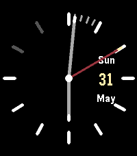
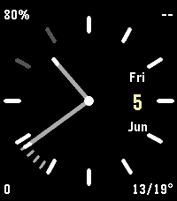
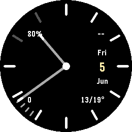
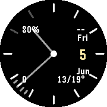
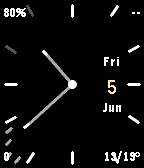
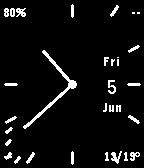
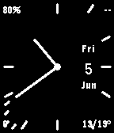

# Crisp

Simple, customizable Pebble watchface with splashes of color.

Built with the current RePebble SDK for every Pebble platform — **Pebble Time 2**
(emery, 200×228) and **Pebble Round 2** (gabbro, 260×260 round) down to the
classic 144×168 watches. The dial scales to the display, so the hands, markers
and date block are laid out relative to the screen rather than at fixed pixel
positions. Emery renders the round dial too, matching the Pebble Round 2 look.



| emery | gabbro | chalk |
|:---:|:---:|:---:|
|  |  |  |
| **basalt** | **aplite** | **diorite / flint** |
|  |  |  |

## Features

The watchface shows an analog clock with thin edge markers, the current
5‑minute sector of minute ticks, an optional date block (weekday / day of
month / month), and four optional corner readouts. Use the configuration page
(the gear icon next to the watchface in the Pebble app) to adjust:

- Show weekday/month
- Show day of the month
- Show second hand (off by default)
- Show battery level on the hour markers
- Show disconnected indicator
- The content of each screen corner — nothing, battery, Bluetooth, heart rate,
  step count, weather (today's low/high temperature) or rain chance
- Temperature unit: automatic (follows the watch's metric/imperial setting),
  Celsius or Fahrenheit
- The colors of every element (markers, hands, tips, second hand, day of month)

The display toggles, colors and corner choices are handled offline by
[Clay](https://www.npmjs.com/package/@rebble/clay); no hosted config page is
required. **Weather and rain chance** are fetched on the phone from the free,
key-less [Open-Meteo](https://open-meteo.com/) API using the phone's location
and relayed to the watch, so those two corners need the Pebble app connected and
location access granted.

## Build

```bash
npm install                               # fetch the Clay dependency
pebble build                              # -> build/Crisp-watchface.pbw
pebble install --emulator emery           # or: gabbro
pebble screenshot --no-open --emulator emery
```
